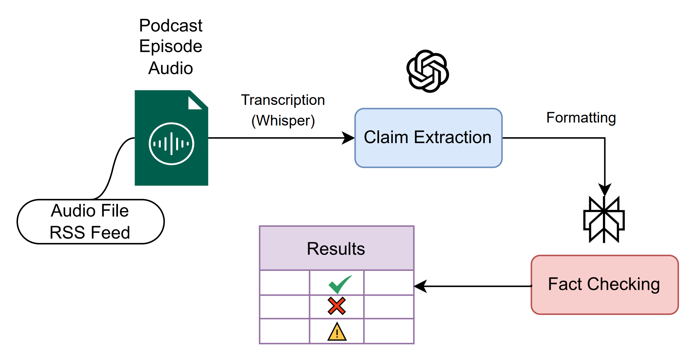

# PodChecker

## Overview

PodChecker is a user-facing automated fact-checking companion for podcasts. It ingests podcast episode audio and uses LLMs to extract and fact-check the claims made within. This tool provides claim-level factuality assessments with supporting source URLs as well as an aggregated overview.



## Quickstart

### 1. Installation

Clone this repository:

```
git clone https://github.com/annatastic/PodChecker.git
```

Install dependencies:

```
pip3 install pandas install openai
pip3 install --upgrade pip 
pip install openai-whisper
brew install ffmpeg
```


which ffmpeg
```# add ffmpeg path
import os
os.environ["PATH"] += os.pathsep + "/opt/homebrew/bin"
```

### 2. Run the web app
Run backend: 
```
cd site/backend
python3 app.py
```

In a seperate terminal, run frontend: 
```
cd site/frontend
npm run dev
```

The application will be available at port `5173`

### 3. Provide input
Paste your OpenAI and Perplexity API keys into the provided fields. Upload an audio file from your computer or paste an RSS feed link to the podcast and hit `submit analysis`

To view a pre-processed example, select a sample report from the `sample report` dropdown. 

## Citation

If you use this code, please include the following citation:

```
@inproceedings{irmetova2026podchecker,
  title={PodChecker: An Interpretable Fact-Checking Companion for Podcasts},
  author={Irmetova, Anna and Liu, Haoran and Teleki, Maria and Carragher, Peter and Zhang, Julie and Caverlee, James},
  year={2026},
}
```

